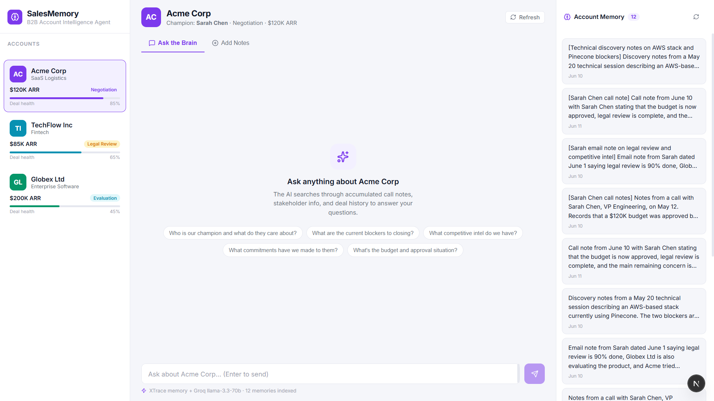
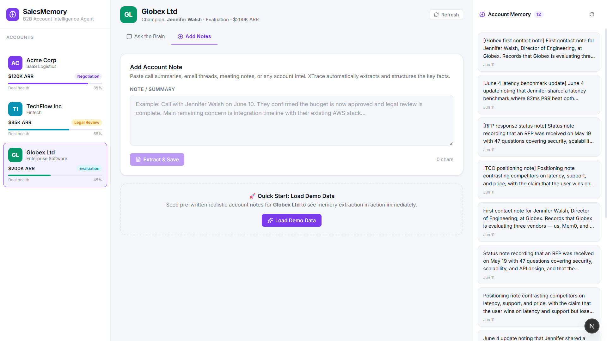

# SalesMemory — B2B Account Intelligence Agent

> AI-powered sales memory agent using XTrace — ask anything about an account and get answers grounded in your team's actual call notes, emails, and deal history.

---

## 🎯 The Pain Point

When a sales rep leaves or a deal changes hands, **all institutional account knowledge disappears**. The incoming FDE has to rediscover:
- Who the champion is and what they care about
- What pain points were uncovered in discovery calls
- What commitments have already been made to the customer
- What competitive objections came up and how they were handled

Meanwhile, the customer expects continuity. This knowledge gap costs deals.

**With XTrace, it doesn't have to.**

---

## 💡 The Solution

**SalesMemory** is a B2B Account Intelligence Agent that gives every sales rep instant access to everything the team knows about an account — structured, searchable, always current.

Every call summary, email insight, stakeholder mention, and competitive note gets ingested into XTrace memory scoped to the account. Any rep can query it before a call and get grounded, cited answers in seconds.

This maps directly to XTrace's stated B2B FDE/SE use case: *"Your AI knows the account better than the last rep did."*

---

## 🏗️ Architecture

```
┌─────────────────────────────────────────────┐
│              SalesMemory UI                 │
│  ┌──────────┐  ┌──────────┐  ┌──────────┐   │
│  │ Account  │  │  Chat /  │  │  Live    │   │
│  │ Selector │  │  Ingest  │  │ Memory   │   │
│  │          │  │   Tabs   │  │ Viewer   │   │
│  └──────────┘  └──────────┘  └──────────┘   │
└──────────────────────┬──────────────────────┘
                       │
          ┌────────────▼─────────────┐
          │     Next.js API Routes   │
          │  /api/chat  /api/memories│
          └────────────┬─────────────┘
                       │
        ┌──────────────▼──────────────┐
        │      XTrace Memory API      │
        │  user_id = account brain    │
        │  ingest → extract → search  │
        └─────────────────────────────┘
                       │
        ┌──────────────▼──────────────┐
        │   Groq llama-3.3-70b        │
        │   RAG: memory injected      │
        │   into system prompt        │
        └─────────────────────────────┘
```

### Key XTrace Features Used

| Feature | How it's used |
|---|---|
| **`memories.ingest()`** | Call notes and emails are ingested → facts extracted automatically by XTrace |
| **`memories.search()`** | Semantic vector search scoped to `user_id: accountId` for per-account memory |
| **`{ wait: true }` ingest** | Synchronous extraction for immediate feedback on manual note ingestion |
| **Parallel async ingest** | Seed data fires all notes in parallel for fast bulk ingestion |
| **RAG pattern** | Memory retrieved before every LLM call, injected as context — grounded answers |

---

## 🚀 Features

### 3-Panel Interface
- **Left:** Account selector with deal health score, stage badge, and ARR
- **Center:** Chat (AI Q&A) and Add Notes (ingest) tabs
- **Right:** Live extracted memory viewer with per-memory delete

### Chat Intelligence
- Ask natural language questions: *"What's the current blocker?"*, *"Who's our champion?"*
- XTrace memory is searched server-side before every LLM call (RAG)
- Retrieved facts are injected into the system prompt — grounded, no hallucination
- Streaming responses via Vercel AI SDK + Groq llama-3.3-70b

### Memory Ingest
- Paste any free-form text (call summary, email, meeting notes)
- XTrace extracts structured facts automatically in the background
- 3 pre-seeded demo accounts with realistic B2B scenarios

### Demo Accounts
| Account | Industry | Stage | Value |
|---|---|---|---|
| **Acme Corp** | SaaS Logistics | Negotiation | $120K ARR |
| **TechFlow Inc** | Fintech | Legal Review | $85K ARR |
| **Globex Ltd** | Enterprise Software | Evaluation | $200K ARR |

---

## 🛠️ Tech Stack

- **Framework:** Next.js (App Router), TypeScript
- **AI:** Vercel AI SDK + Groq `llama-3.3-70b-versatile`
- **Memory:** `@xtraceai/memory` SDK
- **Styling:** Vanilla CSS, clean light theme, Inter font, Lucide icons

---

## User Interface

- Chat view
  
  
  
- Notes view

  

---

## ⚡ Quick Start

```bash
# Clone and install
git clone https://github.com/Kritansh-Tank/sales-memory-agent
cd sales-memory-agent
npm install

# Set environment variables
cp .env.example .env.local
# Fill in XTRACE_API_KEY, XTRACE_ORG_ID, GROQ_API_KEY

# Run dev server
npm run dev
```

Open [http://localhost:3000](http://localhost:3000).

**To see it in action:**
1. Select **Acme Corp** from the sidebar
2. Click **Add Notes** → **Load Demo Data** (waits ~8s for XTrace extraction)
3. Switch to **Ask the Brain**
4. Ask: *"Who is our champion and what's their main concern?"*

---

## 🌍 Environment Variables

```
XTRACE_API_KEY=xtk_...      # from app.xtrace.ai → Settings → API Keys
XTRACE_ORG_ID=...           # from app.xtrace.ai → Settings → API Keys
GROQ_API_KEY=gsk_...        # from console.groq.com
```

Get XTrace credentials free at [app.xtrace.ai](https://app.xtrace.ai)
Get Groq credentials free at [console.groq.com](https://console.groq.com)

---

## 📜 License

MIT License - See [LICENSE](./LICENSE.md) file for details
